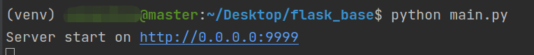

##
flask_base

1.项目结构如下:

    ├── common-----------------------------------基础配置相关
    │   ├── app.py-------------------------------服务初始配置
    │   ├── __init__.py
    │   ├── plugins.py---------------------------一些公共的方法
    │   └── urls.py------------------------------总路由
    ├── component
    │   ├── __init__.py
    │   ├── mysql--------------------------------数据库相关
    │   │   ├── db_session.py--------------------数据库连接相关
    │   │   ├── __init__.py
    │   └── redis--------------------------------redis相关（待扩充）
    │       └── __init__.py
    ├── config
    │   ├── app_config.py------------------------公有的常量配置
    │   ├── __init__.py
    ├── main.py
    ├── module
    │   ├── __init__.py
    │   └── user---------------------------------测试模块（可删除）
    │       ├── __init__.py
    │       ├── models.py------------------------业务模型（通用）
    │       ├── res_code.py----------------------状态码
    │       ├── service.py-----------------------业务相关逻辑（低层）
    │       ├── urls.py--------------------------业务路由
    │       └── views.py-------------------------业务相关逻辑（高层）
    ├── readme.md
    └── requirements.txt

2.依赖环境：

* python3.5及以上
* mysql数据库

3.运行方法:

    进入到flask_base目录，运行pip install -r requirements.txt
    运行python ./main.py

如下:

4.其他:

* 接口文档生成工具采用的是apidoc

